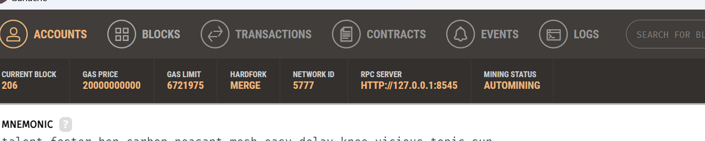
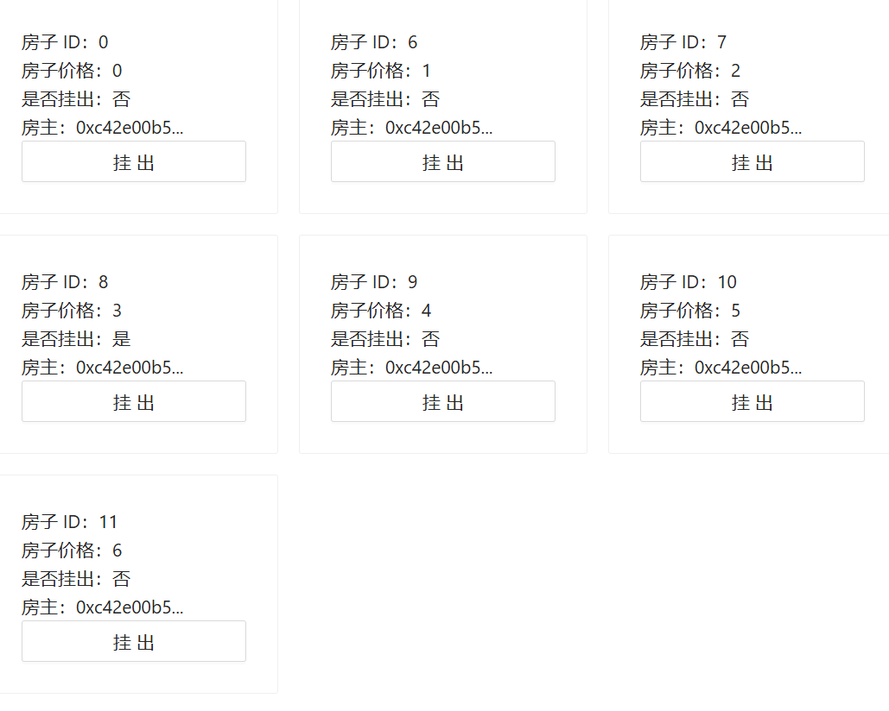
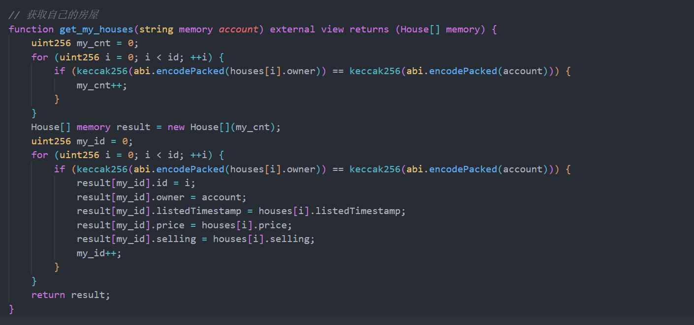
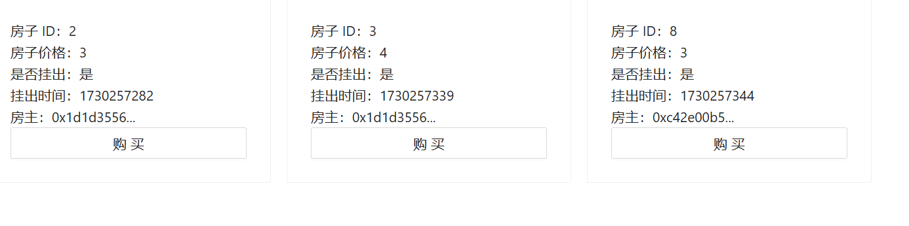
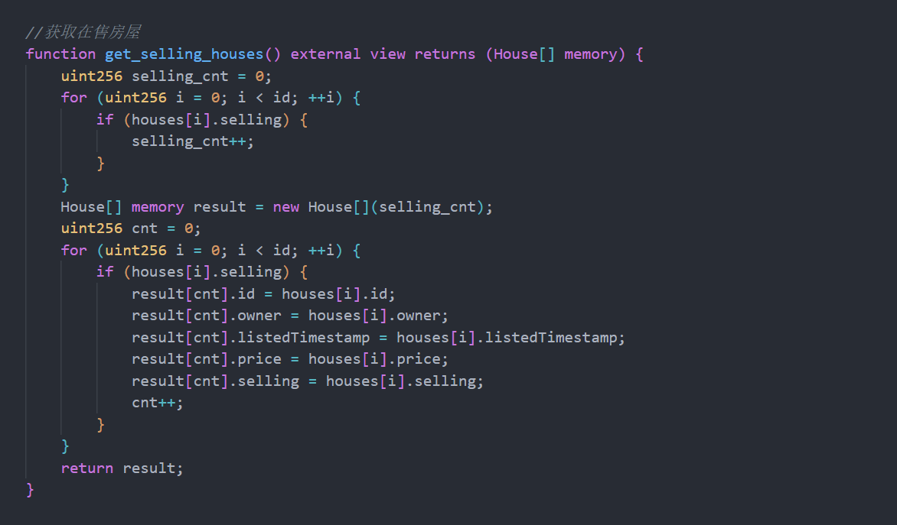
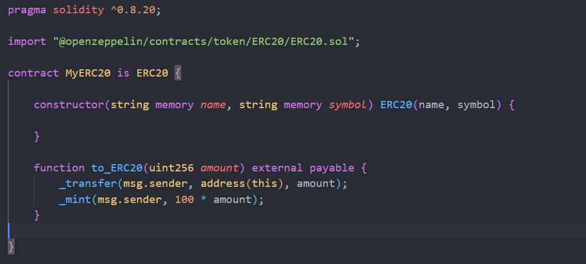
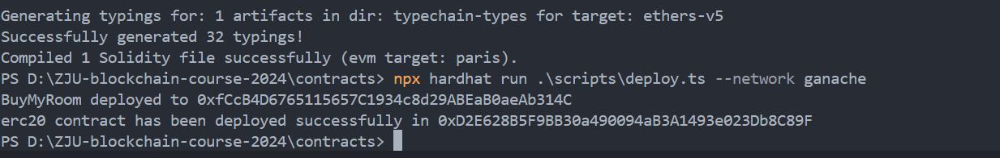
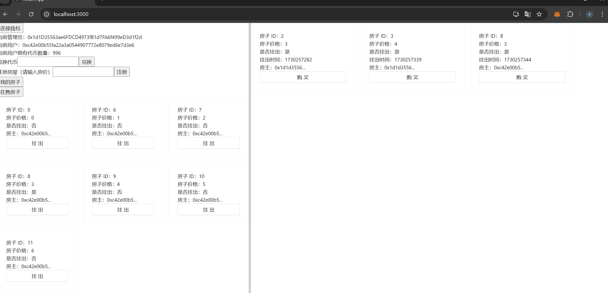
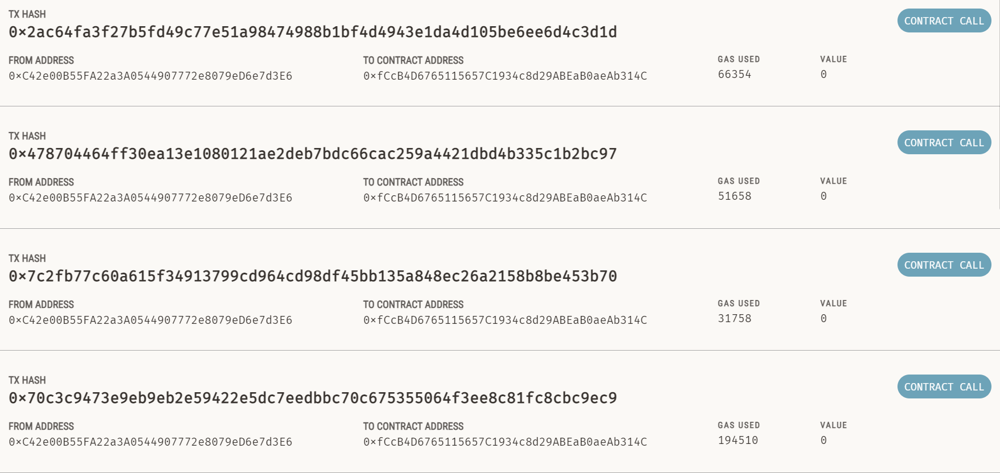
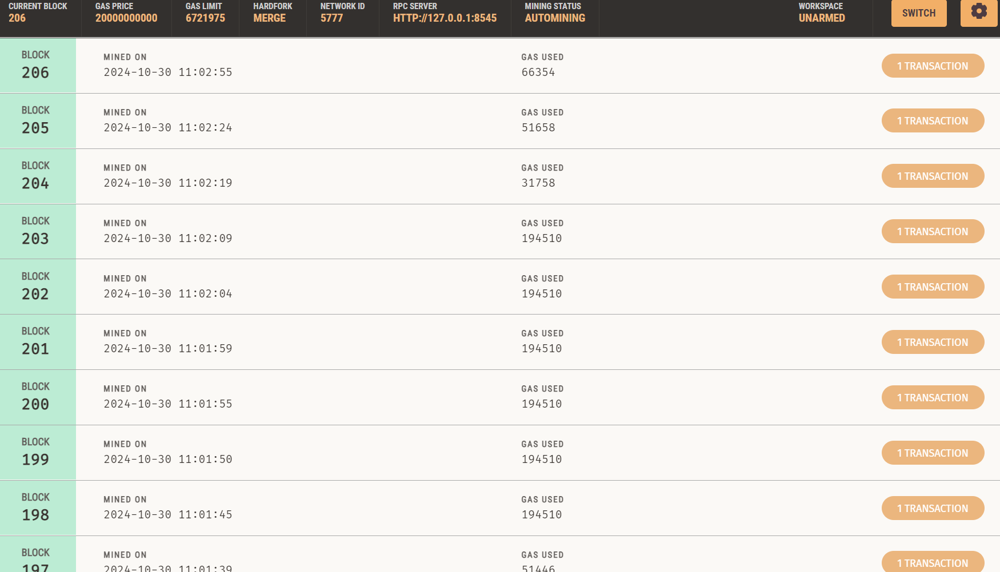

# ZJU-blockchain-course-2024

⬆ 可以️修改成你自己的项目名。

## 如何运行

补充如何完整运行你的应用。

1. 在本地启动ganache应用。端口设置为8545


2. 在 `./contracts` 中安装需要的依赖，运行如下的命令：
    ```bash
    npm install
    ```
3. 在 `./contracts` 中编译合约，运行如下的命令：
    ```bash
    npx hardhat compile
    ```

4.
     ```bash
        npx hardhat run .\scripts\deploy.ts --network ganache
    ```

5. 在 `./frontend` 中安装需要的依赖，运行如下的命令：
    ```bash
    npm install
    ```
6. 在 `./frontend` 中启动前端程序，运行如下的命令：
    ```bash
    npm start
    ```
## 功能实现分析

简单描述：项目完成了要求的哪些功能？每个功能具体是如何实现的？

建议分点列出。

1. 用户查看自己拥有的房产列表。并可以挂单出售自己的房屋（挂单包含价格等信息）。



2. 用户查看所有出售中的房产，并查询一栋房产的主人，及各种挂单信息。



3. 用户选择支付房屋价格对应的测试以太币，购买某个其他用户出售的房产。购买后房产拥有权应当发生变化。

见操作视频

4. 平台收取手续费：在一个房产出售完成时，用户支付的部分测试以太币（=某栋房产在平台上的挂单时长（timestamp）* 固定比例 * 房产价格）应该被转入某个特定账户（如合约部署者）。

```
uint256 price1 = 10 * houses[id].price;
uint256 price2 = 100 * houses[id].price - price1;
myERC20.transferFrom(msg.sender, seller, price2);
myERC20.transferFrom(msg.sender, manager, price1);
```
这里设置手续费为10%， 可按需求更改

5. 发行一个（ERC20）合约，允许用户将测试以太币兑换成ERC20积分，并使用ERC20积分完成购买房屋的流程。



## 项目运行截图

放一些项目运行截图。

项目运行成功的关键页面和流程截图。主要包括操作流程以及和区块链交互的截图。





Genecha相关



## 参考内容

- 课程的参考Demo见：[DEMOs](https://github.com/LBruyne/blockchain-course-demos)。

- 快速实现 ERC721 和 ERC20：[模版](https://wizard.openzeppelin.com/#erc20)。记得安装相关依赖 ``"@openzeppelin/contracts": "^5.0.0"``。

- 如何实现ETH和ERC20的兑换？ [参考讲解](https://www.wtf.academy/en/docs/solidity-103/DEX/)

如果有其它参考的内容，也请在这里陈列。

Solidity address 转 string 
[参考讲解](https://blog.csdn.net/BradMoon/article/details/123350573)
